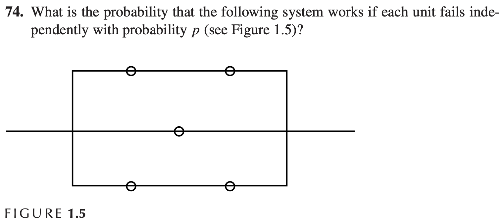

### Solution

#### Step 1: The probability that the first and third paths does not work
Accoding to the problem, we can know the probability that each unit fails independently is p, so the probability that the first path doesn't work is

$$
P(the first path doesn't work) = P(the third path doesn't work) = p * p = p^2
$$

#### Step 2: Probability that Both Paths Fail
The system will fail only if both paths fail. The probability that a path fails is:
\[
P(\text{Path fails}) = 1 - P(\text{Path works}) = 1 - (1 - p)^3
\]
Thus, the probability that both paths fail is:
\[
P(\text{Both paths fail}) = \left(1 - (1 - p)^3\right)^2
\]

#### Step 3: Probability that the System Works
The probability that the system works is the complement of the probability that both paths fail:
\[
P(\text{System works}) = 1 - P(\text{Both paths fail}) = 1 - \left(1 - (1 - p)^3\right)^2
\]

### Final Answer
Thus, the probability that the system works is:
\[
P(\text{System works}) = 1 - \left(1 - (1 - p)^3\right)^2
\]

