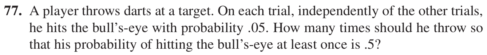

### Solution

#### Step 1: Probability that the player can hit the bull's-eye on each trial
The probability that the player can hit the bull's-eye on each trial is

$$
P(\text{the player can hit the bull's eye on each trial}) = 0.05
$$

#### Step 2: Probability that the player can hit the bull's-eye at least once

$$
P(\text{the player can hit the bull's-eye at least once}) = 1 - P(\text{the player can't hit the bull's-eye at all in n trials}) \ge 0.5
$$

#### Step 3: Probability that the player can't hit the bull's-eye at all in n trials

$$
P(\text{the player can't hit the bull's-eye at all in n trials}) = ( 1 - P(\text{the player can hit the bull's eye on each trial}))^n = (1-0.05)^n^ = 0.95^n
$$

#### Step 4: Combine Step 3 and Step 4

$$
P(\text{the player can't hit the bull's-eye at all in n trials}) = 0.95^n \le 0.5
$$

#### Step 5: Find n

$$
0.95^n \le 0.5 \\
log0.95^n \le log0.5 \\
nlog0.95 \le log0.5 \\
n \ge \frac{log0.5}{log0.95} \\
  ≈ \frac{-0.3010}{−0.0223} \\
  ≈ 13.5\\
\therefore n = 14\\
$$

### Final Answer
Thus, the player should throw 14 times so that his probability of hitting the bull's-eye at least once is 0.5.
