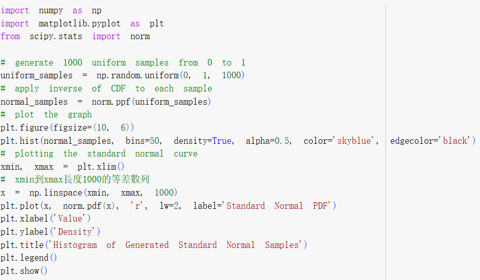
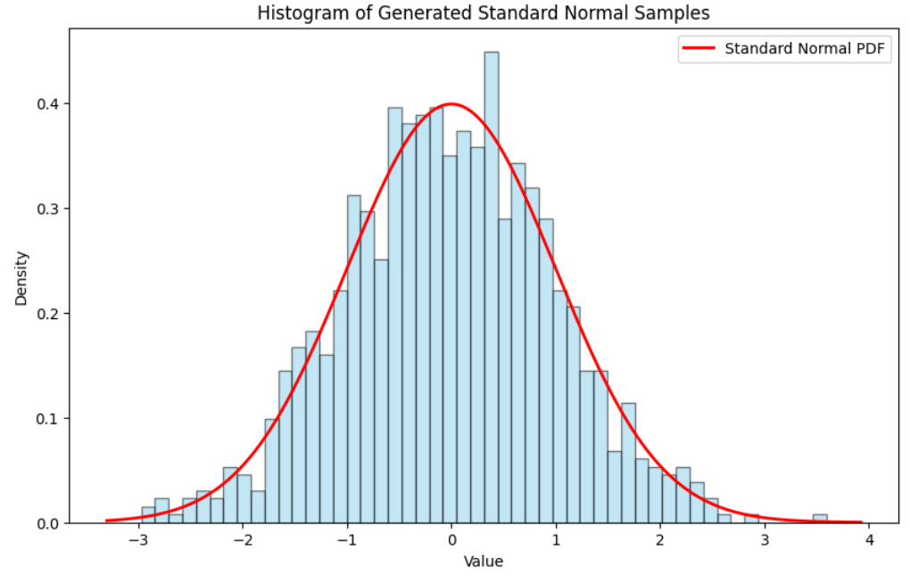

# Q1
## Problem
What are the key points in Lec 1105
## Solution
# Q2
## Problem
## Solution
# Q3
## Problem
## Solution
# Q4
## Problem
Use the inverse method to generate 1000 samples of stnadard normal
## Solution

# Q5
## Problem
## Solution
