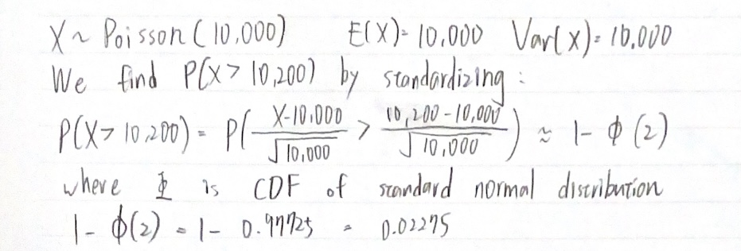

Suppose that the number of insurance claims, X, filed in a year is Poisson
distributed with $E(X) = 10,000$. Use the normal approximation to the Poisson
to approximate $P(X > 10,200)$.

TA 施昱全(James) reviewed on 202401213 and score $\textbf{\textcolor{red}{100}}$. 
